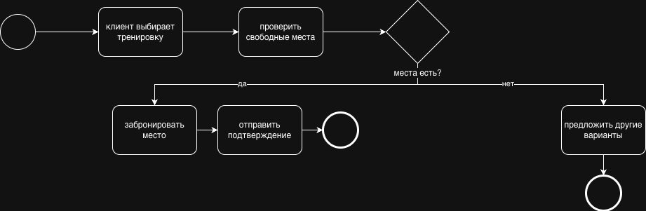

# Модель бизнес-процессов в нотации BPMN

## Процесс "Запись клиента на тренировку"

### Описание процесса:

1. **Старт** — клиент решает записаться на тренировку
2. **Клиент выбирает тренировку** — выбор даты, времени, типа занятия
3. **Проверить свободные места** — система проверяет доступность
4. **Решение "Места есть?"** — проверка результата
   - **ДА** → переход к бронированию
   - **НЕТ** → предложение альтернатив

### Ветка "ДА" (успешное бронирование):
- **Забронировать место** — фиксация записи в системе
- **Отправить подтверждение** — уведомление клиента
- **Конец** — процесс завершён успешно

### Ветка "НЕТ" (мест нет):
- **Предложить другие варианты** — альтернативные даты/тренировки
- **Конец** — процесс завершён

### Участники процесса:
- **Клиент** — инициатор процесса
- **Информационная система** — исполнитель проверок и уведомлений
