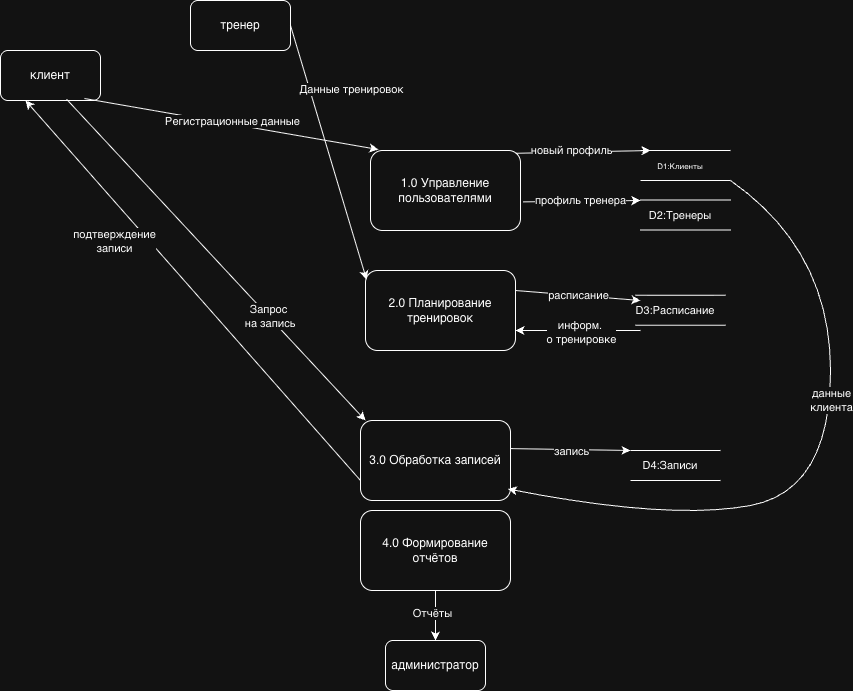

# Диаграмма потоков данных (DFD)

## Уровень 1: Основные процессы системы

### Описание диаграммы

Диаграмма потоков данных уровня 1 показывает основные процессы системы "Fit Arena" и потоки информации между ними.

#### Внешние сущности:
1. **Клиент** — пользователь фитнес-центра
2. **Тренер** — сотрудник фитнес-центра
3. **Администратор** — управляющий персонал

#### Основные процессы:
1. **1.0 Управление пользователями** — регистрация клиентов и тренеров
2. **2.0 Планирование тренировок** — формирование расписания занятий
3. **3.0 Обработка записей** — бронирование мест на тренировки
4. **4.0 Формирование отчётов** — аналитика и статистика

#### Хранилища данных:
- **D1: Клиенты** — база данных клиентов
- **D2: Тренеры** — база данных тренеров
- **D3: Расписание** — база расписания тренировок
- **D4: Записи** — история бронирований

#### Основные потоки данных:
1. Клиент → Регистрационные данные → Управление пользователями
2. Клиент → Запрос на запись → Обработка записей
3. Тренер → Данные тренировок → Планирование тренировок
4. Обработка записей → Подтверждение → Клиент
5. Формирование отчетов → Отчеты → Администратор
