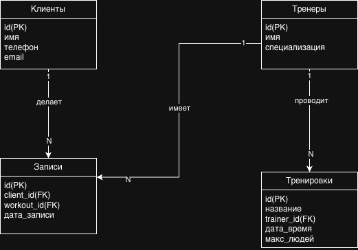

# ER-диаграмма базы данных

## Схема базы данных системы "Fit Arena"

### Описание таблиц:

#### 1. Таблица "Клиенты"
- **id** (PK) — уникальный идентификатор клиента
- **имя** — полное имя клиента
- **телефон** — контактный телефон
- **email** — электронная почта

#### 2. Таблица "Тренеры"
- **id** (PK) — уникальный идентификатор тренера
- **имя** — полное имя тренера
- **специализация** — направление тренировок

#### 3. Таблица "Тренировки"
- **id** (PK) — уникальный идентификатор тренировки
- **название** — название тренировки
- **trainer_id** (FK) — ссылка на тренера
- **дата_время** — дата и время проведения
- **макс_людей** — максимальное количество участников

#### 4. Таблица "Записи"
- **id** (PK) — уникальный идентификатор записи
- **client_id** (FK) — ссылка на клиента
- **workout_id** (FK) — ссылка на тренировку
- **дата_записи** — дата и время создания записи

### Связи между таблицами:

1. **Тренеры → Тренировки** (1:N)
   - Один тренер может проводить много тренировок
   - Связь через поле `trainer_id` в таблице "Тренировки"

2. **Клиенты → Записи** (1:N)
   - Один клиент может делать много записей
   - Связь через поле `client_id` в таблице "Записи"

3. **Тренировки → Записи** (1:N)
   - На одну тренировку может быть много записей
   - Связь через поле `workout_id` в таблице "Записи"

### Особенности проектирования:
- Все таблицы имеют первичный ключ (PK) типа SERIAL
- Используются внешние ключи (FK) для обеспечения ссылочной целостности
- Схема нормализована до третьей нормальной формы (3NF)
