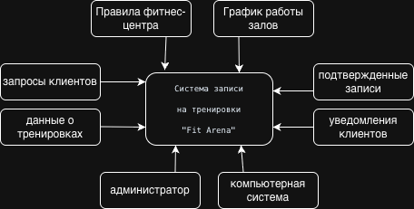
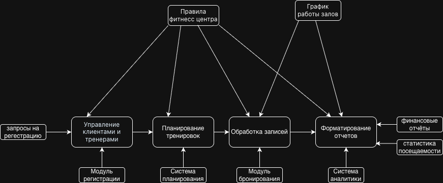
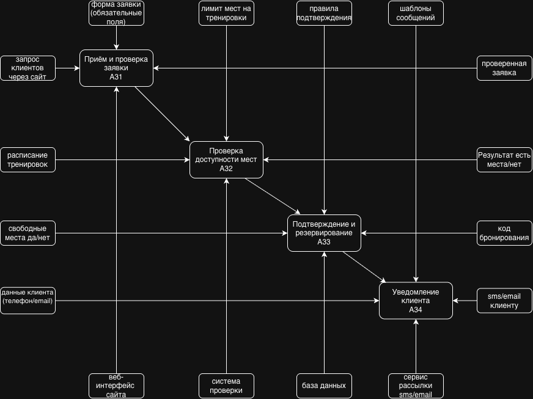

# Модель процессов в нотации IDEF0

## 1. Уровень A0: Контекстная диаграмма  

### Комментарий к уровню A0  
Контекстная диаграмма показывает систему "Управление фитнес-центром" как единый функциональный блок.  

**Элементы диаграммы:**  
- **Входы (Input):** Запросы клиентов, данные о тренировках — что поступает в систему.  
- **Выходы (Output):** Подтверждённые записи, уведомления — что система производит.  
- **Управление (Control):** Правила фитнес-центра, график работы — регламентируют процесс.  
- **Механизмы (Mechanism):** Администратор, компьютерная система — кто/что выполняет процесс.  

---

## 2. Уровень A1: Декомпозиция первого уровня  

### Комментарий к уровню A1  
Диаграмма декомпозиции первого уровня разбивает основную систему на 4 ключевых подпроцесса:  

1. **A1: Управление клиентами и тренерами** – работа с пользовательскими данными.  
2. **A2: Планирование тренировок** – формирование расписания и распределение ресурсов.  
3. **A3: Обработка записей** – основной бизнес-процесс системы бронирования.  
4. **A4: Формирование отчётов** – аналитика и статистика для управления.  

**Особенности:** Показаны взаимосвязи между процессами и общие механизмы управления.  

---

## 3. Уровень A2: Декомпозиция второго уровня  

### Комментарий к уровню A2  
Детализация процесса "Обработка записей" (A3) на 4 последовательных подпроцесса:  

1. **A31: Приём заявки** – клиент отправляет запрос через веб-интерфейс.  
2. **A32: Проверка доступности** – система проверяет свободные места.  
3. **A33: Подтверждение записей** – резервирование места при наличии.  
4. **A34: Уведомление клиента** – автоматическая отправка подтверждения.  

**Архитектурный смысл:** Демонстрация внутренней логики ключевого бизнес-процесса с выделением управляющих воздействий и исполнительных механизмов.  

---

## 4. Общие комментарии к модели IDEF0  

### Методологические особенности  
Модель построена в соответствии со стандартом IDEF0, который предусматривает:  
- Иерархическую декомпозицию процессов  
- Чёткое разделение входов, выходов, управлений и механизмов  
- Последовательную детализацию от общего к частному  

### Практическая значимость  
1. **Для анализа:** Выявление узких мест и оптимизация процессов  
2. **Для разработки:** Чёткие требования к функциональности системы  
3. **Для внедрения:** Понимание бизнес-логики всеми участниками проекта  

### Соответствие теме проекта  
Модель полностью отражает бизнес-процессы фитнес-центра "Fit Arena", связанные с онлайн-записью на тренировки, что соответствует заявленной теме проекта.  
