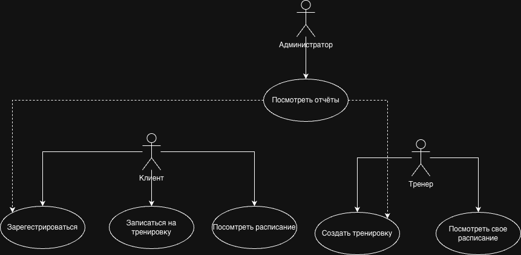
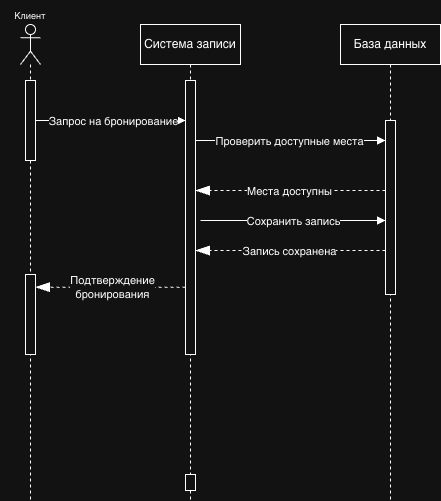

# UML-диаграммы системы "Fit Arena"

## 1. Диаграмма классов (Class Diagram)

### Основные классы:

#### 1.1 Client (Клиент)
- **Атрибуты:** id, name, phone, email
- **Методы:** register(), viewHistory()

#### 1.2 Trainer (Тренер)
- **Атрибуты:** id, name, specialization
- **Методы:** createWorkout(), viewSchedule(), viewRatings()

#### 1.3 Workout (Тренировка)
- **Атрибуты:** id, title, trainer_id, date_time, max_people
- **Методы:** checkAvailability(), addToSchedule(), cancel()

#### 1.4 Registration (Запись)
- **Атрибуты:** id, client_id, workout_id, registration_date
- **Методы:** create(), cancel(), confirm()

### Связи между классами:
1. **Trainer → Workout** (1:*) — один тренер проводит много тренировок
2. **Workout → Registration** (1:*) — одна тренировка имеет много записей
3. **Client → Registration** (1:*) — один клиент делает много записей

## 2. Диаграмма прецедентов (Use Case Diagram)

### Основные актёры системы:

#### 2.1 Клиент
- **Зарегистрироваться** — создание учётной записи
- **Записаться на тренировку** — бронирование места на занятие
- **Посмотреть расписание** — просмотр доступных тренировок

#### 2.2 Тренер
- **Создать тренировку** — добавление нового занятия в расписание
- **Посмотреть своё расписание** — просмотр назначенных занятий

#### 2.3 Администратор
- **Просмотреть отчёты** — анализ статистики и финансовых показателей
- **Дополнительные возможности:** регистрация пользователей, создание тренировок

## 3. Диаграмма последовательности (Sequence Diagram)

### Процесс "Запись клиента на тренировку"

#### Участники:
1. **Клиент** — инициатор процесса
2. **Система записи** — основной обработчик запросов
3. **База данных** — хранилище информации

#### Последовательность действий:

1. **Клиент отправляет запрос** на бронирование тренировки
2. **Система проверяет** в базе данных доступность мест
3. **База данных возвращает** результат проверки
4. **Система сохраняет запись** в БД при наличии мест
5. **База данных подтверждает** успешное сохранение
6. **Система отправляет подтверждение** клиенту

#### Ключевые сообщения:
- `Запрос на бронирование` — начало процесса
- `Проверить доступные места` — проверка возможности
- `Сохранить запись` — фиксация бронирования
- `Подтверждение бронирования` — завершение процесса

---

## Заключение

Представленные UML-диаграммы полностью описывают структуру и поведение информационной системы "Fit Arena" с трёх ключевых точек зрения: статическая структура (диаграмма классов), функциональные возможности (диаграмма прецедентов) и динамическое взаимодействие (диаграмма последовательности).

### Взаимодействие:
- Каждый актёр имеет свой набор доступных действий
- Администратор обладает расширенными правами доступа
- Система обеспечивает разделение ролей и прав доступа
