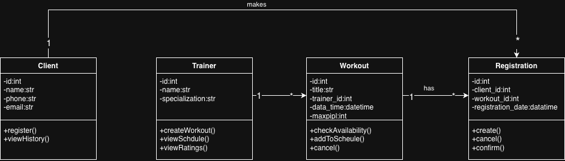

# UML-диаграммы системы "Fit Arena"

## 1. Диаграмма классов (Class Diagram)

### Основные классы:

#### 1.1 Client (Клиент)
- **Атрибуты:** id, name, phone, email
- **Методы:** register(), viewHistory()

#### 1.2 Trainer (Тренер)
- **Атрибуты:** id, name, specialization
- **Методы:** createWorkout(), viewSchedule(), viewRatings()

#### 1.3 Workout (Тренировка)
- **Атрибуты:** id, title, trainer_id, date_time, max_people
- **Методы:** checkAvailability(), addToSchedule(), cancel()

#### 1.4 Registration (Запись)
- **Атрибуты:** id, client_id, workout_id, registration_date
- **Методы:** create(), cancel(), confirm()

### Связи между классами:
1. **Trainer → Workout** (1:*) — один тренер проводит много тренировок
2. **Workout → Registration** (1:*) — одна тренировка имеет много записей
3. **Client → Registration** (1:*) — один клиент делает много записей
